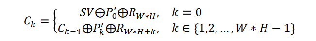
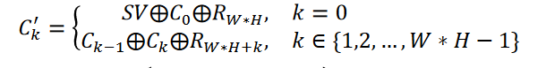
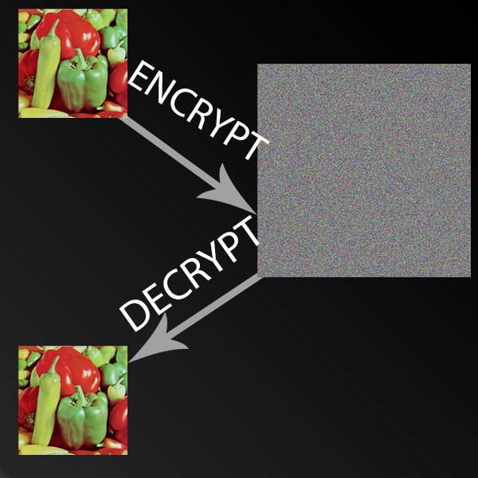
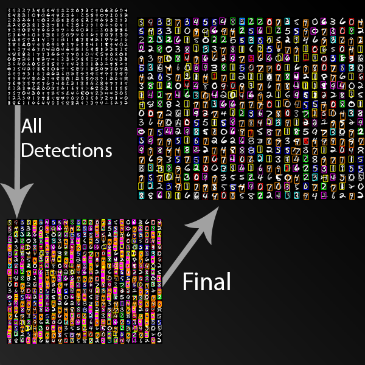

# BMP-cryptography-digital-processing
Developed using C, this project consists of 2 parts.  
The first part is cryptography related, in particular encrypting and decrypting a Bitmap.  
The second part is a template matching algorithm used for detecting digits on a Bitmap.

## Motivation
This project was developed during a Procedural Programming course I took in my first year studying Computer Science at the University of Bucharest.

## How do I use it?
Simply copy the main.c source file and the BMP images. Then, compile and run the program.  
If you want to encrypt another BMP or if you want to test the template matching algorithm on another bitmap, place the BMP in the same directory as the main.c source file and use its name when calling the functions in the main function.

## How does the cryptography part work?
In order to encrypt the given BMP the following algorithm is used:  
A sequence of random numbers R = (R1, R2, ..., R2 * width * height - 1) is generated using the XORSHIFT32 generator initialized with the R0 value which has to be placed in a 'secret_key.txt' file.   
A random permutation is also generated using Durstenfeld's algorithm. The bitmap's pixels are then permuted using the permuation.
Finally, we obtain the ciphered image by substituting the pixels using the following substitution relation:  
  
where SV (starting value) has to be placed in a 'secret_key.txt' file.  
In order to decrypt the encrypted the BMP we basically mirror the encryption algorithm:  
A sequence of random numbers is generated using the XORSHIFT32 generator.  
We generate the sequence random of numbers using the XORSHIFT32 generator.  
A random permutation is also generated using Durstenfeld's algorithm and we compute its inverse.  
The pixels are substituted using the inverse substitution relation:  
  
Finally, the original image is obtained by permuting the pixels.  

  
## How does the digital image processing part work?
The purpose of this part is to detect digits on a BMP that contains multiple digits.  
To achieve this without using machine learning algorithms, we can use a template matching algorithm.  
First, we need 10 templates, each one with a different digit.  
Then, the image containing the digits and templates are converted into grayscale images.  
For each template, we glide it over the image, centering the template in each point of the image. For each (x, y) position on the image, the algorithm computes a cross-correlation score between the current template and that part of the image.    
We will consider 'detections' those parts of the image that have a cross-correlation higher than a given threshold (in this case 0.5). To visualize the detections easily, they will be colored, using a different color for each digit. All the detections are stored in an array that is then sorted descending by the cross-correlation score. The sorted array is processed from the left (detections with high score) to the right (detections with low score) like this: all detections dj which overlay spatially with the current detection di, with i < j and,
therefore, score(di) > score(dj) are removed.  
  

